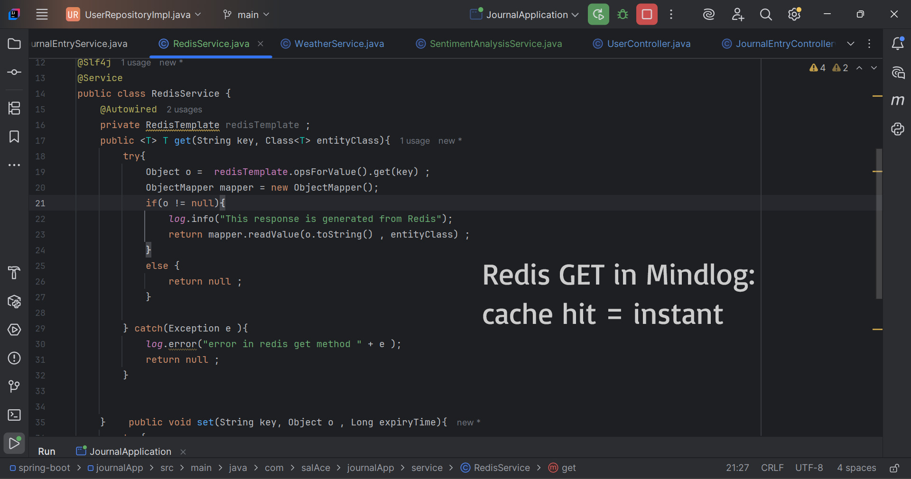

# 📖 JournalApp

[]()
[]()
[]()
[]()
[]()
[]()
[]()

A production-ready backend built with **Spring Boot 3**, **Spring Security 6**, **MongoDB**, **Redis**, **JWT Authentication**, and **Docker**.

JournalApp lets users securely manage personal journal entries, with role-based authorization, sentiment analysis, email notifications, text-to-speech generation, weather integration, Redis caching, and cloud deployment.

---

## 🚀 Live Application

```text
https://journal-app-3fpe.onrender.com
```

---

## 📑 Table of Contents

- [Core Features](#-core-features)
- [Architecture](#️-architecture)
- [Technology Stack](#️-technology-stack)
- [Project Structure](#-project-structure)
- [Getting Started](#-getting-started)
- [Environment Variables](#️-environment-variables)
- [API Reference](#-api-reference)
- [Redis Caching](#-redis-caching)
- [Docker Deployment](#-docker-deployment)
- [Security Highlights](#-security-highlights)
- [Roadmap](#-roadmap)
- [Author](#-author)

---

## ✨ Core Features

### 🔐 Authentication & Authorization
- JWT authentication, stateless architecture
- Spring Security 6 + BCrypt password hashing
- Role-based access control (`USER`, `ADMIN`)

### 📓 Journal Management
- Create, update, delete, and retrieve journal entries
- Sentiment tracking per entry
- Per-user data isolation

### 👤 User Management
- Registration & secure login
- Profile and password updates
- Email and sentiment-analysis preferences

### 👨‍💼 Admin Features
- Create admin accounts
- View all registered users
- Role-protected admin endpoints

### ⚡ Performance & Scalability
- Redis caching to cut redundant DB calls
- Faster API response times

### 🤖 AI & Utility Services
- Text-to-speech generation
- Sentiment analysis
- Email notifications
- Weather info integration

### ☁️ Deployment & DevOps
- Dockerized app
- GitHub Actions CI pipeline
- Render cloud deployment
- OpenAPI/Swagger docs

---

## 🏗️ Architecture

```text
Client
   │
   ▼
JWT Authentication Filter
   │
   ▼
Spring Security
   │
   ▼
Controllers
   │
   ▼
Services
   │
 ┌─┴───────────────┐
 ▼                 ▼
Redis Cache     MongoDB
```

---

## 🛠️ Technology Stack

| Layer          | Tech                                              |
|----------------|----------------------------------------------------|
| Backend        | Java 17, Spring Boot 3, Spring Security 6, Maven   |
| Data           | Spring Data MongoDB, MongoDB Atlas                 |
| Caching        | Redis, Spring Cache                                |
| Security       | JWT, BCrypt, RBAC                                  |
| Docs           | OpenAPI 3, Swagger UI                              |
| DevOps         | Docker, GitHub Actions, Render                     |

---

## 📂 Project Structure

```text
src
├── main
│   ├── java
│   │   ├── config
│   │   ├── controller
│   │   ├── entity
│   │   ├── enums
│   │   ├── filter
│   │   ├── repo
│   │   ├── service
│   │   ├── cache
│   │   ├── schedular
│   │   ├── utils
│   │   └── JournalApplication.java
│   └── resources
│       ├── static
│       └── application.properties
└── test
```

---

## 🚀 Getting Started

### Prerequisites
- Java 17+
- Maven
- MongoDB Atlas URI
- Redis instance

### Clone & Run

```bash
git clone https://github.com/sal12321/Journal-Entry-App.git
cd Journal-Entry-App
mvn clean package
java -jar target/*.jar
```

App runs at `http://localhost:8080`.

---

## ⚙️ Environment Variables

Create a `.env` or set these in your environment:

```env
MONGODB_URI=your_mongodb_uri
JWT_SECRET=your_jwt_secret
REDIS_HOST=your_redis_host
REDIS_PORT=your_redis_port
EMAIL_USERNAME=your_email
EMAIL_PASSWORD=your_email_password
GEMINI_API_KEY=your_api_key
```

---

## 📚 API Reference

Full interactive docs via Swagger UI at `/swagger-ui.html`, or import into Postman via the OpenAPI spec.

### 🔑 Auth

| Method | Endpoint          | Description         |
|--------|-------------------|----------------------|
| POST   | `/public/signup`  | Register new user   |
| POST   | `/public/login`   | Login, returns JWT  |

**Register**
```json
POST /public/signup
{
  "userName": "john",
  "password": "password123",
  "email": "john@example.com"
}
```

**Login**
```json
POST /public/login
{
  "userName": "john",
  "password": "password123"
}
```
Response:
```json
{ "token": "JWT_TOKEN" }
```

Use the token on protected routes:
```http
Authorization: Bearer JWT_TOKEN
```

### 📓 Journal

| Method | Endpoint             | Description             |
|--------|-----------------------|--------------------------|
| POST   | `/journal`             | Create entry             |
| GET    | `/journal`              | Get all entries (user)   |
| GET    | `/journal/id/{id}`      | Get entry by ID          |
| PUT    | `/journal/id/{id}`      | Update entry             |
| DELETE | `/journal/id/{id}`      | Delete entry              |

```json
POST /journal
{
  "title": "My First Journal",
  "content": "Today was productive.",
  "sentiment": "HAPPY"
}
```

### 👨‍💼 Admin

| Method | Endpoint                | Description        |
|--------|--------------------------|---------------------|
| POST   | `/admin/create-admin`    | Create admin user  |
| GET    | `/admin/all-users`       | List all users     |

### 🎙️ Text-to-Speech

```json
POST /TextToVoice
{
  "text": "Hello World",
  "modelId": "voice-model"
}
```
Returns audio output.

---

## ⚡ Redis Caching

Frequently accessed data is cached in Redis to cut repeated MongoDB queries — faster responses, lower DB load, better scalability under concurrent users.

---

## 🐳 Docker Deployment

```bash
docker build -t journal-app .
docker run -p 8080:8080 journal-app
```
App available at `http://localhost:8080`.

---

## 🔒 Security Highlights

- JWT-based, stateless authentication
- BCrypt password hashing
- Role-based authorization on admin routes
- Protected REST endpoints throughout

---

## 📈 Performance Highlights

- Redis caching layer
- Optimized DB access patterns
- Reduced response latency under load

---

## 🔮 Roadmap

- [ ] Refresh token support
- [ ] OAuth2 authentication
- [ ] API rate limiting
- [ ] Kubernetes deployment
- [ ] Distributed tracing
- [ ] Multi-factor authentication (MFA)

---

## 📸 Screenshots

| Swagger | Redis | MongoDB | SonarQube |
|---------|-------|---------|-----------|
|  |  |  |  |

---

## 👨‍💻 Author

**Sal**
Full-stack developer — Java/Spring Boot, Node.js/Express, React/Vite, MongoDB

- GitHub: [@sal12321](https://github.com/sal12321)

---

## ⭐ Support

If this project is useful, drop a star on the repo.
